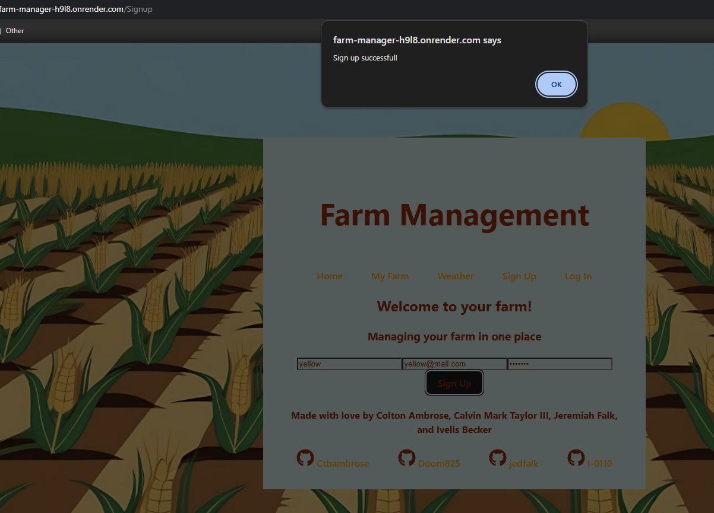
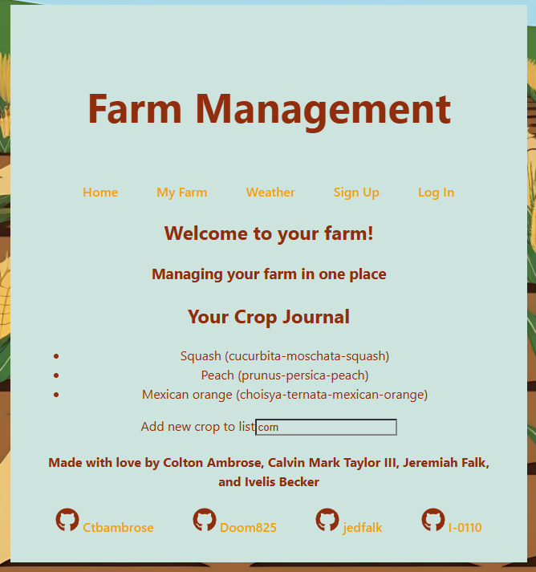
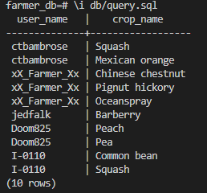

# FarmManagment

## Description

The concept of this project was something that started years ago when I was just out of college with my Computer Information Systems degree. My family is made up of lots of farmers and we were at a birthday party for one of my cousins and they were talking about issues they had been having that year with crops and livestock. He pulled out a small notebook he kept in his shirt pocket and started flipping through for details. I chimed asking "Is that really how you keep track of all of your day-to-day info for the farm?" The farmers all looked at me like I was crazy, almost to say "how else would we keep track of it?" 

That lead me to the basis of this project that I was able to get a MVP(Minimal Viable Product) for while in my full stack coding boot camp. This was a farm management application that allowed individuals to login and check weather forecast for their area as well track crops that they had planted. This is far from a finished product that I am looking to create, but it does show the ability to track and manage a farm much more efficiently than with a pocket notebook.

## Tech Stack and APIs
**Frontend:**\
    React, TypeScript, JavaScript

**Backend:**\
    Node.js, Express, GraphQL 

**Database:**\
    PostgreSQL

**APIs:**\
    [permapeople](https://permapeople.org/knowledgebase/api-docs.html): This is an opensource API that provides vast amounts of information on plants including growth conditions, physical characteristics, uses, where to find them, and much more.\
    [OpenWeather](https://openweathermap.org/api): This is a commonly used API for weather apps of all sizes. It can provide weather forecasting from current time to 8 days out, it also has access to weather day from over 40 years ago.

## Usage

The three main features that this project was demonstrating were user creation, a crop journal, and a database that stored individual users’ information/crops.

### **User Creation**

The application starts with you on a login page that allows you to either login as an existing user or create a new users.

### **Crop Journal**

Once you are logged in you can view your farm. From there you can add crops to your Crop Journal. You are also able to view any crops that have already been added to your Crop Journal, and you are prevented from adding crops that already exist in your journal.

### **Database**

Both our user’s creation/login and crop journal were only functional due to the database that we had, it can be viewed in the repo at server\src\models

This is the query that was run to provide the image bellow:

>SELECT users.user_name, crops.crop_name\
>From user_crop\
>INNER JOIN users ON users.user_id=user_crop.user_id\
>INNER JOIN crops ON crops.crop_id=user_crop.crop_id\
>ORDER BY users.user_id;

## Challenges
We face quite a few challenges on this project, but I will limit this to the top three: Database set up confusion, finding proper APIs for what we wanted, and getting the crop journal to function as I would like.

### **Database Confusion**
While doing the building for the databases I did not realize that when you set up models using Object-Document Mapper (ODM) that you did not need .sql files. There was a disconnect for me around what the models were used for and how to correctly implement them. It ended up with me having to have a meeting with my instructor to get clarification so that I could get clarification on how they are correctly used.

### **Finding APIs**
I had different functionality in mind for this project when we started that I was really wanting added. The problem with this was we had one week for the whole project, not every API is free, and not all information has an API. This became a major limiting factor for some of the functionality, mainly the inclusion of USDA Hardiness zones based on zip code as well as planting window for the crops.

### **Crop Journal**
The Crop Journal ended up being the part of the project to cause the most issues for us. The problems included pulling in all crops from permapeople, searching for a specific crop once we had pulled in the crops, associating a crop with the logged in user, and many more. For this issue group members take one issue for a set amount of time and work on it. Once the time had elapsed, we would then share what progress had been made and discuss what issues we were still having. We would then brainstorm next steps and possible fixes and then decide if we wanted to change which of the issues, we were working on to get fresh eyes on it. It took us a while, but we were able to get all the issues worked out as a team.

## Future
In the future I see this app becoming an all in on location for farm management, but I do have three things that stand out to me most. The three areas I would like to start expanding on the Crop Journal's functionality, adding livestock management, and adding field management.

### **Crop Journal Functionality**
I plan on adding in the parts of the Crop Journal that could not be added into the MVP for the project such as adding the USDA Hardness zones and planting windows based on zip code. I had also investigated adding a true journal functionality for each crop so that you could notate things like pest issues, rain impact, and more. I would also like to be able to find a way to implement market value for each crop and where you can purchase seeds for them as well as distributors. 

### **Livestock Management**
I plan on adding livestock as the application in a major step toward farm management. The first thing to implement would be a livestock tracker including identifier for each animal and information about them including species, breed, age/birth date, and more. I would also like to include breeding charts and tracking so that you can at a glance lineage of the animals, what traits have carried down, and possibly even possible breeding partners.

### **Field Management**
I plan on adding in the field management so that immediately you will be able to see at each plot of land what crops/livestock is located there and what it has been overtime. I was also able to find an API that can be used to get satellite images of fields every few days so that you have an updated image of the land at a glance. I could also integrate realtor data to see if land near yours is up for sale and what the asking price would be.

